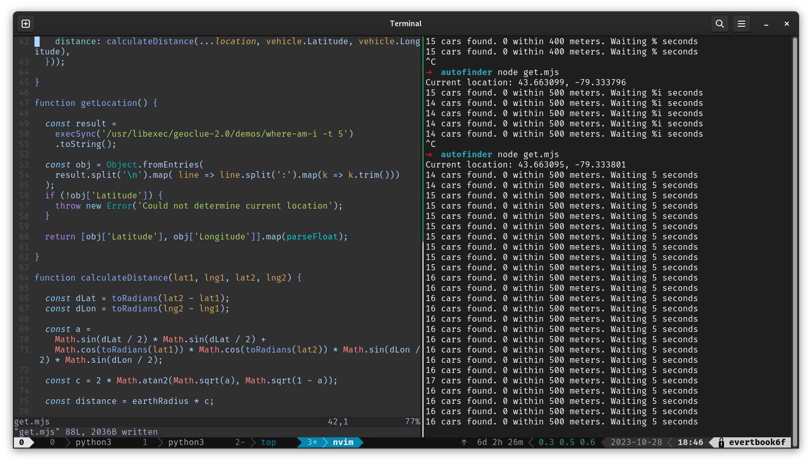

Look for close-by Communauto flex cars and get an alert
========================================================

Sick of refreshing the app or (even worse!) the web app for a close-by car?
This command-line script checks nearby cars on a loop and pops up a desktop
notification when it finds one.




Installation
------------

This script has been tested on Fedora Linux 39 and requires Node and
`geoclue2-demos` to fetch the current latitude and longitude.
If you are on any other system and it doesn't work, let me know
via an issue and I'll update this script to get it to work.

## Fedora

```
sudo dnf install geoclue2-demos nodejs
```

Usage
-----

Just run `./run.mjs`. 

The script defaults to Toronto. To switch to
Quebec:

```
./run.mjs --city quebec
```
